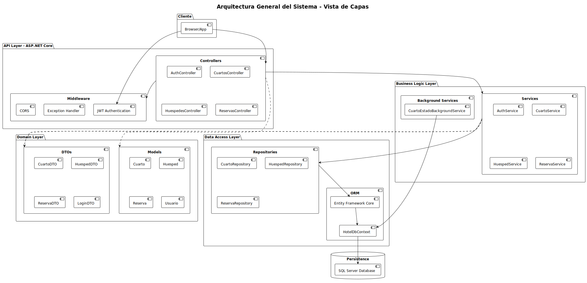
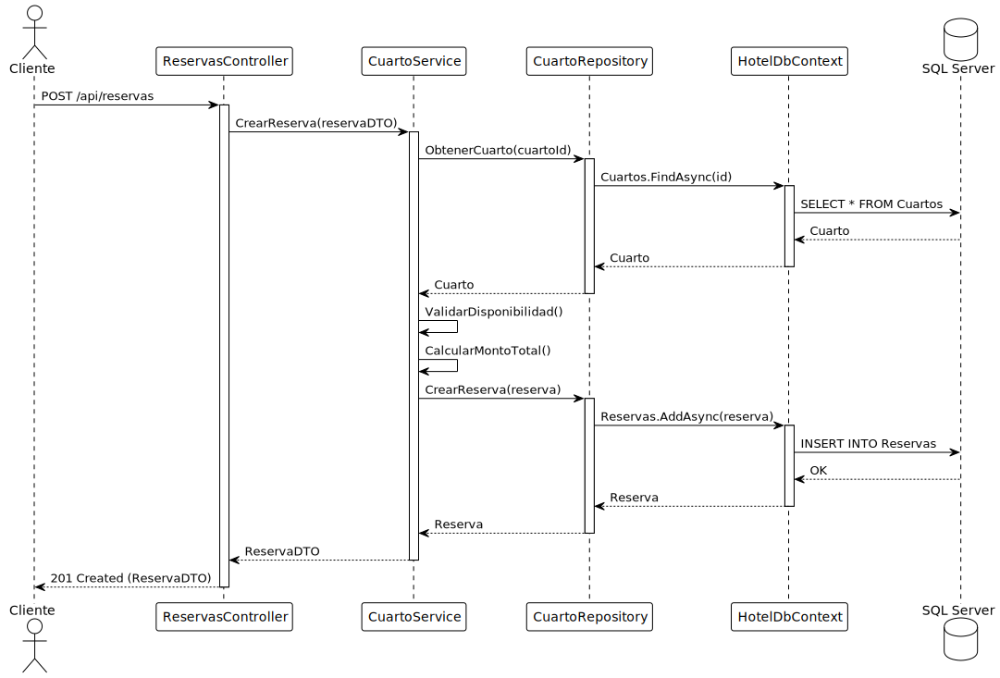
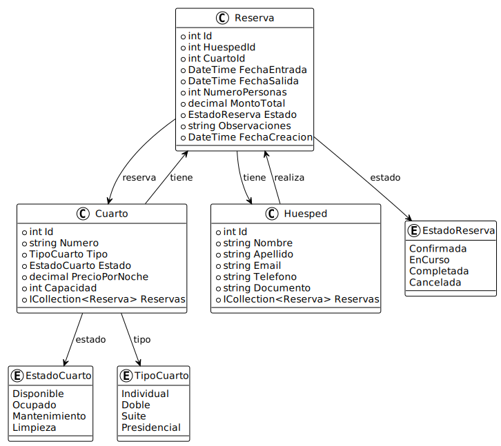
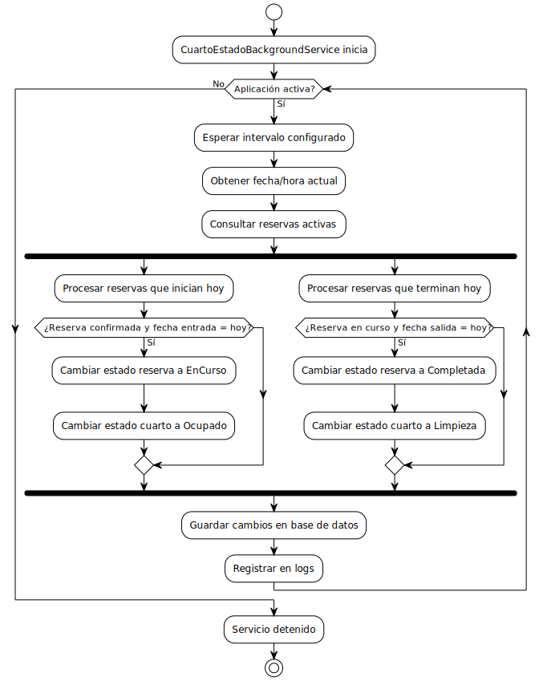

# Diagramas de Arquitectura del Sistema

Este documento describe la arquitectura del sistema de gestión hotelera, destacando los componentes principales, sus interacciones y las ventajas del diseño arquitectónico implementado.

---

## Arquitectura General del Sistema - Vista de Capas

### Descripción

El sistema está organizado en una **arquitectura de N capas** que separa las responsabilidades en diferentes niveles:

#### **1. Capa de Cliente**
- **Browser/App**: Interfaz de usuario desarrollada en React con TypeScript
- Se comunica con el backend mediante peticiones HTTP/REST
- Implementa autenticación JWT para acceso seguro

#### **2. API Layer (ASP.NET Core)**
- **Controllers**: Manejan las peticiones HTTP (Auth, Cuartos, Huéspedes, Reservas)
- **Middleware**: 
  - JWT Authentication para seguridad
  - Exception Handler para manejo centralizado de errores
  - CORS para permitir comunicación cross-origin

#### **3. Business Logic Layer**
- **Services**: Implementan la lógica de negocio
  - `AuthService`: Autenticación y gestión de usuarios
  - `CuartoService`: Gestión de habitaciones
  - `HuespedService`: Gestión de huéspedes
  - `ReservaService`: Gestión de reservas
- **Background Services**: 
  - `CuartoEstadoBackgroundService`: Actualiza automáticamente el estado de cuartos y reservas

#### **4. Data Access Layer**
- **Repositories**: Patrón Repository para acceso a datos
  - `CuartoRepository`
  - `HuespedRepository`
  - `ReservaRepository`
- **ORM**: Entity Framework Core para mapeo objeto-relacional
- **DbContext**: `HotelDbContext` gestiona la conexión con la base de datos

#### **5. Domain Layer**
- **Models**: Entidades del dominio (Cuarto, Huesped, Reserva, Usuario)
- **DTOs**: Data Transfer Objects para comunicación entre capas

#### **6. Persistence**
- **SQL Server Database**: Almacenamiento persistente de datos

### Ventajas de esta Arquitectura

✅ **Separación de Responsabilidades**: Cada capa tiene una función específica y bien definida

✅ **Mantenibilidad**: Los cambios en una capa no afectan directamente a las demás

✅ **Testabilidad**: Las capas pueden probarse de forma independiente mediante unit tests

✅ **Escalabilidad**: Permite escalar componentes específicos según la demanda

✅ **Reutilización**: Los servicios y repositorios pueden ser reutilizados en diferentes contextos

✅ **Seguridad**: La autenticación JWT y el middleware centralizado protegen el sistema

---

## Flujo de Creación de Reserva

### Descripción

Este diagrama de secuencia muestra el flujo completo para crear una nueva reserva en el sistema:

1. **Cliente → ReservasController**: Envía petición POST `/api/reservas` con los datos de la reserva
2. **Controller → CuartoService**: Invoca el método `CrearReserva(reservaDTO)`
3. **Service → CuartoRepository**: Obtiene información del cuarto solicitado
4. **Repository → DbContext**: Consulta la base de datos usando `Cuartos.FindAsync(id)`
5. **DbContext → SQL Server**: Ejecuta `SELECT * FROM Cuartos`
6. **SQL Server devuelve** los datos del cuarto a través de todas las capas
7. **CuartoService valida**:
   - Disponibilidad del cuarto para las fechas solicitadas
   - Calcula el monto total de la reserva
8. **Service → Repository**: Crea la reserva con `CrearReserva(reserva)`
9. **Repository → DbContext**: Agrega la reserva usando `Reservas.AddAsync(reserva)`
10. **DbContext → SQL Server**: Ejecuta `INSERT INTO Reservas`
11. **Confirmación**: La reserva creada se devuelve al cliente con código 201 Created

### Ventajas de este Flujo

✅ **Validación en Capas**: Los datos se validan en múltiples niveles

✅ **Transaccionalidad**: Entity Framework garantiza la integridad de las operaciones

✅ **Consistencia**: El cálculo del monto y la validación se realizan en el servidor

✅ **Respuestas HTTP Apropiadas**: Uso correcto de códigos de estado (201 Created)

---

## Modelo de Dominio

### Descripción

El modelo de dominio representa las entidades principales del sistema y sus relaciones:

#### **Entidades Principales**

**1. Reserva**
- Propiedades: Id, HuespedId, CuartoId, FechaEntrada, FechaSalida, NumeroPersonas, MontoTotal, Estado, Observaciones
- **Relaciones**:
  - Una reserva está asociada a **un huésped**
  - Una reserva está asociada a **un cuarto**
  - Tiene un estado de tipo `EstadoReserva`

**2. Cuarto**
- Propiedades: Id, Numero, Tipo, Estado, PrecioPorNoche, Capacidad
- **Relaciones**:
  - Un cuarto puede tener **múltiples reservas**
  - Tiene un tipo de tipo `TipoCuarto`
  - Tiene un estado de tipo `EstadoCuarto`

**3. Huesped**
- Propiedades: Id, Nombre, Apellido, Email, Telefono, Documento
- **Relaciones**:
  - Un huésped puede realizar **múltiples reservas**

#### **Enumeraciones**

**EstadoReserva**
- Confirmada
- EnCurso
- Completada
- Cancelada

**EstadoCuarto**
- Disponible
- Ocupado
- Mantenimiento
- Limpieza

**TipoCuarto**
- Individual
- Doble
- Suite
- Presidencial

### Ventajas del Modelo

✅ **Relaciones Claras**: Las asociaciones entre entidades están bien definidas

✅ **Navegación Bidireccional**: Facilita consultas desde cualquier entidad relacionada

✅ **Enumeraciones Tipadas**: Evitan errores de valores inválidos

✅ **Colecciones Virtuales**: Entity Framework gestiona automáticamente las relaciones

---

## Servicio Background - Actualización Automática de Estados

### Descripción

El `CuartoEstadoBackgroundService` es un servicio que se ejecuta en segundo plano para automatizar la gestión de estados:

### Flujo de Ejecución

1. **Inicio del Servicio**: Se inicia cuando la aplicación arranca
2. **Ciclo Principal**:
   - Verifica si la aplicación está activa
   - Espera el intervalo configurado (configurable en appsettings)
   - Obtiene la fecha/hora actual
   - Consulta reservas activas

3. **Procesamiento de Reservas que Inician Hoy**:
   - Filtra reservas confirmadas cuya fecha de entrada es hoy
   - Cambia el estado de la reserva a `EnCurso`
   - Cambia el estado del cuarto a `Ocupado`

4. **Procesamiento de Reservas que Terminan Hoy**:
   - Filtra reservas en curso cuya fecha de salida es hoy
   - Cambia el estado de la reserva a `Completada`
   - Cambia el estado del cuarto a `Limpieza`

5. **Persistencia y Logging**:
   - Guarda todos los cambios en la base de datos
   - Registra las operaciones en logs para auditoría

6. **Finalización**: El servicio se detiene cuando la aplicación se cierra

### Ventajas del Background Service

✅ **Automatización**: No requiere intervención manual para actualizar estados

✅ **Consistencia**: Garantiza que los estados se actualicen puntualmente

✅ **Eficiencia**: Se ejecuta en segundo plano sin afectar el rendimiento de la API

✅ **Configurabilidad**: El intervalo de ejecución es ajustable

✅ **Auditoría**: Registra todas las operaciones realizadas

✅ **Disponibilidad**: Mantiene los cuartos disponibles automáticamente después del checkout

---

## Ventajas Generales de la Arquitectura

### 🏗️ Arquitectura de Capas (Layered Architecture)

1. **Separación de Responsabilidades**
   - Cada capa tiene un propósito específico
   - Facilita la comprensión del sistema

2. **Mantenibilidad**
   - Los cambios se aíslan en la capa correspondiente
   - Reduce el acoplamiento entre componentes

3. **Testabilidad**
   - Cada capa puede testearse independientemente
   - Facilita el uso de mocks y stubs

4. **Escalabilidad**
   - Permite escalar capas específicas según la demanda
   - Fácil migración a microservicios si es necesario

### 🔐 Seguridad

- Autenticación JWT centralizada
- Middleware de manejo de excepciones
- Validación en múltiples capas
- Protección CORS configurada

### 📊 Persistencia

- Entity Framework Core para ORM
- Patrón Repository para abstracción de datos
- Transacciones automáticas
- Migraciones para control de versiones del esquema

### 🔄 Servicios de Fondo

- Automatización de procesos rutinarios
- Actualización automática de estados
- No bloquean las peticiones HTTP
- Configurables y monitoreables

### 🚀 Ventajas Técnicas

- **Código Limpio**: Siguiendo principios SOLID
- **Inversión de Dependencias**: Uso de interfaces para inyección de dependencias
- **Patrón Repository**: Abstracción del acceso a datos
- **DTOs**: Desacoplamiento entre la capa de presentación y el dominio
- **Async/Await**: Operaciones asíncronas para mejor rendimiento

---

## Tecnologías Utilizadas

### Backend
- **ASP.NET Core 8.0**: Framework principal
- **Entity Framework Core**: ORM
- **JWT Bearer Authentication**: Seguridad
- **Swagger/OpenAPI**: Documentación de API
- **MySQL**: Base de datos

### Frontend
- **React 18**: Framework de UI
- **TypeScript**: Tipado estático
- **Vite**: Build tool
- **Chakra UI**: Componentes de interfaz

### DevOps
- **Docker**: Contenedores
- **Docker Compose**: Orquestación
- **Nginx**: Servidor web para el frontend

---

## Conclusión

La arquitectura implementada combina las mejores prácticas de desarrollo de software moderno:

- ✅ Separación de responsabilidades clara
- ✅ Código mantenible y testeable
- ✅ Seguridad robusta
- ✅ Escalabilidad horizontal y vertical
- ✅ Automatización de procesos críticos
- ✅ Persistencia eficiente y confiable

Esta arquitectura permite que el sistema sea **flexible**, **robusto** y **fácil de mantener** a largo plazo.